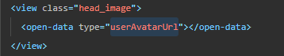
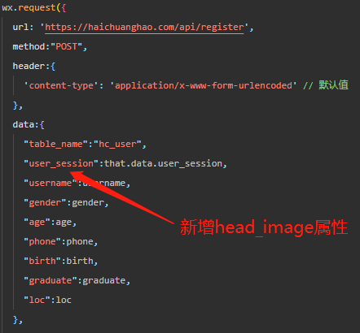

# 优化

#### 头像持久化存储

##### 场景：当前的用户头像是通过微信自带方法直接获得开放数据"userAvatarUrl"进行展示

​			

##### 优化点：

  - 初次获取用户头像 -- 在用户注册时，在现有数据基础上，将头像url也传给后端进行存储(regist.js: line 28)。

    ​                               -- 同时把用户头像存储到本地，方便其他接口使用
    
    ​		
    
  - ~~用户头像更新 -- 用户可能会更换微信头像~~（留在下个版本优，此次可以先不做）
    
    > ~~在进入”个人中心“页时，单独调用头像更新接口。~~	
    >
    > ```json
    >  url: 'https://haichuanghao.com/api/update_head_image',
    >  header:{
    >      'content-type': 'application/x-www-form-urlencoded'
    >  },
    >  method:"POST"
    >  request:{
    >      "user_session":this.data.user_session,//用户session
    >      "head_image": {head image url}
    >  },
    >  
    >  // 返回值
    >  response:{
    >      status:"success"
    >  } 
    >  // 返回值说明
    >  // sucess表示更新成功，刷新页面获取新头像。
    >  // no change表示头像没有变化，不做任何操作
    >  // error表示更新失败。 不做任何操作
    > 
    > ```